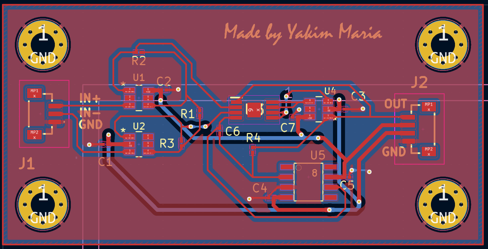

# Разработка печатной платы и схемы электрической принципиальной инструментального усилителя
Целью данной работы является разработка собственного инструментального усилителя и платы для него с использованием операционных усилителей.
Поиск элементов для построения инструментального усилителя производился на ChipDip, модели, посадочные места и символы для найденных элементов были найдены на сайтах SnapEDA (https://www.snapeda.com/) и ComponentSearchEngine (https://componentsearchengine.com/).
Схема электрическая принципиальная инструментального усилителя на 3-х ОУ показана на Рис. 1.

<image src="C:\Users\yamar\Desktop\Новая папка\Main_project/SEP.png" alt="Рисунок 1. Схема электрическая принципиальная инструментального усилителя на 3 ОУ.">

Рисунок 1. Схема электрическая принципиальная инструментального усилителя на 3 ОУ.

Для обеспечения схемы питанием на любой блок, связанный с питанием или землей необходимо добавить PWR_FLAG, который означает, что данная дорожка является дорожкой питания или земли.

После этого была проведена проверка электрических соединений, исправлены возникшие ошибки с отсутствием посадочных мест для элементов, далее нажимаем "Обновить печатную плату" и переходим к её редактированию

В соответствии с СЭП на печатной плате были проведены дорожки между элементами схемы, после чего была произведена сплошная заливка печатной платы слоем меди GND, после чего были проведены питание +-5V (толщина дорожек 0.5 мм) и GND. Печатная плата показана на Рис.2.

Рисунок 2. Разведённая печатная плата

На следующем этапе был осуществлён переход к 3D-модели разведённой печатной платы (см. Рис. 3). Для элементов, у которых не было 3D моделей, они были дополнительно подгружены на посадочные места. Также были нанесены необходимые надписи на слой шелкографии.

Рисунок 3. 3D модель печатной платы
